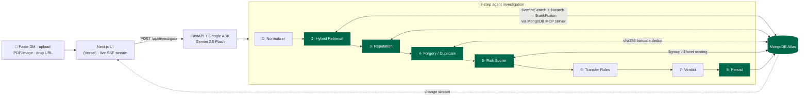

<div align="center">

# 🛡️ TicketGuard

### Spot ticket-resale scams before you pay.

**An AI agent that investigates a suspicious ticket listing or seller DM and returns an evidence-backed scam-risk verdict — grounded in MongoDB, reasoned by Gemini.**

[](https://frontend-nu-ochre-z41mw3z0l5.vercel.app)


</div>

---

## The problem

Major-event ticket resale is a fraud magnet — the FBI, FTC, and BBB are actively warning about a 2026 World Cup resale-scam wave. Buyers have no way to tell a real listing from a "pay me on Zelle, I'll email the PDF" trap until the money's gone.

**TicketGuard** is a consumer agent that runs a real multi-step investigation on a pasted listing / DM / screenshot / URL and returns a verdict: **`SCAM` · `SUSPICIOUS` · `LIKELY-LEGIT`** — with a confidence score and cited evidence. It never claims a ticket is "authentic" (no third party can); it speaks only in **risk signals**.

> Built for the **Google Cloud Rapid Agent Hackathon 2026 — MongoDB track.**

---

## 🏗️ Architecture — MongoDB is the brain



Every green node is real MongoDB work. The risk **score is computed in the database** (`$group`/`$facet`), not by the LLM — so it's reproducible and auditable. The verdict writer only *explains* the gathered evidence.

---

## 🏆 How it meets the hackathon bar

| Requirement | TicketGuard |
|---|---|
| **Gemini agent, multi-step mission** | 8-step ADK pipeline (not a chatbot): normalize → retrieve → reputation → forgery → score → rules → verdict → persist |
| **Integrates the MongoDB MCP server** | Agent reaches Atlas through the official `mongodb-mcp-server` (read-only `find`/`aggregate`/`count`/`collection-schema`) |
| **Deep, meaningful MongoDB use** | **Vector Search + Atlas Search hybrid** (`$rankFusion` on 8.1+, code-fusion fallback) · server-side **`$group`/`$facet`** scoring · **change streams** for the live feed · barcode-hash **dedup** · agent memory |
| **Human-in-the-loop** | Report / Find verified resale / Proceed — and **Report writes to Atlas → change stream → the global corpus gets smarter** |
| **Multi-modal ingestion** | paste text · upload **PDF/screenshot** (Gemini vision OCR + tamper hints) · paste a **URL** |
| **Runs on the web, hosted, open-source** | Next.js (Vercel) + FastAPI (Cloud Run / Render), MIT licensed |
| **Honest by design** | No mock ever drives a verdict — DB-dependent steps return `not_configured` rather than faking |

---

## 🔎 The 8-step investigation

| # | Step | Engine | MongoDB |
|---|------|--------|---------|
| 1 | **Normalizer** | Gemini structured extraction | — |
| 2 | **Hybrid Retrieval** | `$vectorSearch` + `$search`, fused | `scam_corpus` |
| 3 | **Reputation** | typosquat distance + prior reports | `reports` |
| 4 | **Forgery / Duplicate** | `sha256(barcode)` lookup + PDF/image tamper hints | `tickets_seen` |
| 5 | **Risk Scorer** | server-side `$group`/`$facet` (not the LLM) | Atlas |
| 6 | **Transfer Rules** | deterministic rule engine | `official_rules` |
| 7 | **Verdict** | Gemini, grounded only on evidence | — |
| 8 | **Persist** | agent memory | `investigations` |

Real verdict from the live API (Atlas off → DB steps honestly `not_configured`):
```jsonc
{ "verdict": "SCAM", "confidence": 0.9,
  "evidence": ["Unofficial PDF transfer", "Irreversible Zelle payment",
               "Price 120 USD far below face 350 USD", "Urgency cues", "Violates official transfer rules"],
  "engine": "gemini-2.5-flash · Google AI Studio" }
```

---

## 🧩 Tech stack

- **Frontend** — Next.js 14 (App Router) + Tailwind + Framer Motion, light/dark, consumes SSE. Deploys to **Vercel**.
- **Backend** — Python **FastAPI** + **Google ADK** agents, **Gemini 2.5 Flash** (AI Studio or Vertex), streams SSE. Deploys to **Cloud Run / Render** (Docker ships Node + Python so the MCP server runs).
- **Data / brain** — **MongoDB Atlas**: Vector Search (`gemini-embedding` / `text-embedding-004`, 768-dim) + Atlas Search, change streams, the official MongoDB MCP server.

---

## 🚀 Quick start

```bash
# Backend
cd backend
python -m venv .venv && .venv\Scripts\activate      # (Windows)
pip install -r requirements.txt
copy .env.example .env                               # fill MONGODB_URI + GOOGLE_API_KEY
python scripts/setup_atlas.py                        # create indexes + seed corpus
uvicorn main:app --reload --port 8001

# Frontend (new shell)
cd frontend && npm install && npm run dev            # http://localhost:3000
```

Full setup, deployment, env vars, and **how to edit the Gemini prompts** → **[HANDOFF.md](HANDOFF.md)**.

---

## 📊 Evaluation

A labeled set of synthetic scam/legit examples (`backend/data/eval_set.json`) measures precision / recall so impact is quantified, not claimed.

## ⚖️ Responsible-use

Decision-support only — **not a guarantee**; verify independently. Risk-signal language, never accusations. Synthetic demo data only. No trademarked marks.

## 📂 Structure

```
backend/   FastAPI + ADK agents + MongoDB (agent.py · pipeline.py · ingest.py · db.py · scripts/setup_atlas.py)
frontend/  Next.js UI (app/ · components/ · lib/)
HANDOFF.md Full contributor + deploy guide
```

## License
[MIT](LICENSE)
